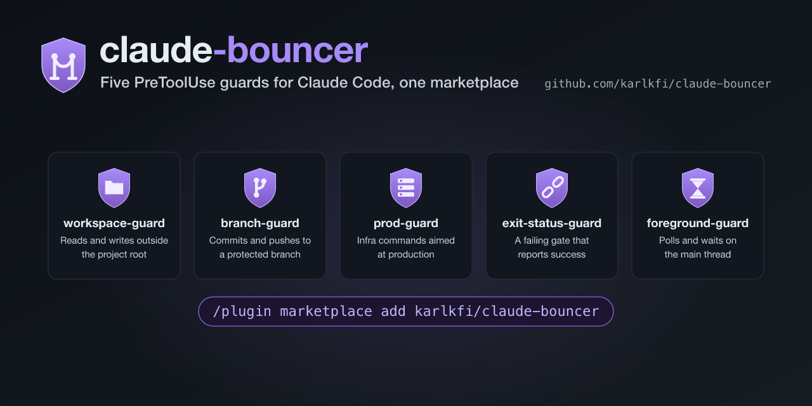

# claude-bouncer

🛡️ **Guard rails for Claude Code: five `PreToolUse` guard plugins in one marketplace.**

[](https://github.com/karlkfi/claude-bouncer/actions/workflows/tests.yml) [](LICENSE) [](#install)



> The bouncer doesn't care what name you go by.
> He only cares how you behave.

Claude Code's permission rules judge a shell command by its name, and a name is a bad ID. 

- `Bash(grep:*)` can't tell an in-repo grep from one reading `~/.aws/credentials`.
- `Bash(git push:*)` can't tell `claude/fix-42` from `main`.
- `Bash(kubectl:*)` can't tell your local kind cluster from the one your customers are on.

So you either trust every command, or you answer a prompt every time.

These five plugins are `PreToolUse` hooks that read the command arguments instead.
They work five different doors and ask five different questions:

- Are you in the right workspace?
- Are you in the right branch?
- Are you in the right infrastructure environment?
- Are you hiding your exit status?
- Are you blocking the session's main thread?

## Install

```
/plugin marketplace add karlkfi/claude-bouncer
```

Then install whichever you want. They're independent and work in any combination:

```
/plugin install workspace-guard@claude-bouncer
/plugin install branch-guard@claude-bouncer
/plugin install prod-guard@claude-bouncer
/plugin install exit-status-guard@claude-bouncer
/plugin install foreground-guard@claude-bouncer
```

## The five guards

| | Plugin | Version | What it stops at the door |
| --- | --- | --- | --- |
|  | [workspace-guard](plugins/workspace-guard) | 1.11.0 | `grep`/`sed`/`jq`/`cat` reading or writing outside the workspace, and blind process kills |
|  | [branch-guard](plugins/branch-guard) | 1.10.0 | Commits and pushes to a protected branch, and destructive `git`/`gh` commands. Auto-approves the safe ones |
|  | [prod-guard](plugins/prod-guard) | 2.5.1 | Mutating `kubectl`/`helm`/`terraform`/`gcloud`/`aws` aimed at production, or relying on ambient context that can change under it |
|  | [exit-status-guard](plugins/exit-status-guard) | 2.0.1 | A gate whose failure reads as success: piped into a filter, backgrounded behind an `echo`, or sequenced before a state change with `;` |
|  | [foreground-guard](plugins/foreground-guard) | 0.6.0 | Polling and watching on the main thread, and slow commands about to be killed by too short a timeout |

Each plugin's README covers its rules, its config file, its override, and its
`/friction-report` command. Start there. This page is the map.

## How a guard decides: in, carded, or turned away

Every command gets one of three answers, and the interesting one is the third.

**In.** Silence, which defers to your normal permission settings. Most commands
never hear from a guard at all. branch-guard goes further and auto-approves the
git commands it can vouch for, so routine work stops prompting.

**Carded.** An `ask`. Claude Code shows you the prompt with the guard's reason in
it. This is the verdict for a command whose intent the guard genuinely can't
know from the command string: a path outside your project root, a cluster it
doesn't recognize.

**Turned away, with the fix.** A `deny`. The reason goes back to the model rather
than to you, and it carries the rewrite: background it, add `--context prod-us`,
capture `$?` instead of piping into `tail`. The agent fixes the command and comes
straight back through the same door, and nobody at the keyboard is interrupted.
That's a routing decision rather than a severity one. When the fix can be written
into the reason, spending your attention on it buys nothing.

Here's one from the session that wrote this README, quoted as it arrived (paths
shortened, lines re-wrapped). The command was `make check > check.log 2>&1; echo "EXIT=$?"`, backgrounded:

```
exit-status-guard: `make check` runs in the background, but this call's exit
status is its LAST statement's -- an echo exits 0 whatever the gate did, so the
task notification reports success for a failed gate. Capture the status and
re-raise it: cmd > out.log 2>&1; rc=$?; echo "EXIT=$rc"; exit $rc. If the status
genuinely does not matter here, re-run prefixed with
EXIT_STATUS_GUARD_OVERRIDE=<reason>. [...]
```

The rewrite ran on the next call. The suite was green, and this time the exit
code said so.

## The pass

Sometimes the guard is right about the command and wrong about the situation. You
really do want to tail that log for a demo. The incident really is worth a
`kubectl delete pod` against prod-us. So each guard takes a pass, and a pass is a
reason:

```bash
PROD_GUARD_OVERRIDE=incident-4711-approved kubectl --context prod-us delete pod stuck-pod
```

The spelling differs by guard. Four of them read it as a command prefix, because
that's the only form a `PreToolUse` hook can see. workspace-guard reads its own
environment instead, and each plugin's README has the exact form. An override
lands on the record either way: branch-guard and workspace-guard echo your reason
into the decision they emit, and the command that carried it is in the session
transcript regardless.

**A pass doesn't open every door.** It gets you as far as the door it names and
no further:

- branch-guard's break-glass lifts only a verdict whose damage can't leave this
  machine. `restore`, `switch`, `stash`, `reset`, `clean` on a scratch branch,
  yes. Every `gh repo delete`, anything at all on `main`, and every `git push`
  the policy gated on its own account, no, whatever reason you give. The one
  push it reaches is the overlap deny, where the policy had already approved
  the push and the guard withdrew that approval over a stale base.
- prod-guard and workspace-guard downgrade a deny to an ask, so a human still
  answers before the command runs. exit-status-guard and foreground-guard stand
  aside on a pass, because what's at stake there is your own session's time and
  evidence rather than someone else's data.
- A pass named in a commit message, a grep pattern, or an `echo` argument is a
  positional and lifts nothing. Only a real assignment in command position counts.

If you're reaching for a pass on the same rule every day, the rule is wrong.
`/friction-report` in each plugin shows how often a pattern lands, and the
verdict is worth [filing](https://github.com/karlkfi/claude-bouncer/issues)
rather than overriding forever.

## One rulebook: the shared shell parser

All five have to read a shell command before they can judge it, and all five used
to carry their own lexer to do it. The copies drifted. On 2026-08-20
workspace-guard and exit-status-guard fixed the same heredoc bug on the same day,
with different mechanisms, and each fix left a gap the other had already closed.
Neither gap was visible from inside the repository that had it, because both test
suites were green.

`lib/bouncer_parse.py` is the single copy they now share: comment stripping,
heredoc-body removal, command-substitution scanning, `shlex` tokenizing, operator
repair, and command-head normalizing.

What is deliberately not shared is segmentation. foreground-guard needs to know
which segment was backgrounded, exit-status-guard needs the operator that joined
two commands, and prod-guard judges an unterminated heredoc that bash would treat
as data. Forcing one answer onto another guard's question is how the copies
diverged in the first place, so each guard keeps its own segmenter.

### Why every plugin carries its own copy of the parser

Claude Code copies a plugin into
`~/.claude/plugins/cache/<marketplace>/<plugin>/<version>/` at install time, and a
path that climbs out of the plugin root doesn't resolve there. A symlink to a
sibling is dereferenced for a git-hosted marketplace, but skipped for
`--plugin-dir` and local-path installs, which are how this repo gets tested before
release. So each plugin carries a vendored copy under its own `lib/`, and CI fails
if one has drifted:

```
make sync         # copy lib/bouncer_parse.py into each plugin
make sync-check   # fail if a copy is stale
```

Edit `lib/bouncer_parse.py`. Never a vendored copy.

## Repository layout

```
.claude-plugin/marketplace.json   the five entries, sourced from ./plugins/<name>
lib/bouncer_parse.py              the shared parser
scripts/sync-lib.py               vendors it, and the CI drift gate
scripts/render-images.py          rasterizes the brand images, here and per plugin
scripts/queue.py                  reads, orders and checks the backlog
docs/img/                         this repo's brand images and their SVG masters
docs/queue/                       the backlog, one file per item
tests/                            parser tests, gate tests, release-note tests
plugins/<name>/                   one plugin, self-contained
```

## The shared backlog

[`docs/queue/`](docs/queue/README.md) holds the work for all five guards. Each
item is a file, so its priority lives in a `rank` key rather than in a position
in a table and two sessions working different items never touch the same one.
Every item names the plugin it belongs to.

A directory listing sorts `Q10` before `Q2`, so read it with the tool instead:

```
make backlog                            # the whole queue, in priority order
make backlog ARGS='--label prod-guard'  # one plugin's items
make backlog-next                       # the top ready item
```

Prior to unification day, three plugins had their own backlog table, which conflicted on every update.
The other two had no backlog at all and just used GitHub issues, tightly coupled with the hosting provider.
Now they all share a combined backlog with markdown issue files, labels, and git leased IDs that avoid conflicts and preserves history, making metrics collections easy.

## Development and tests

```
make check    # what CI runs: drift, version, backlog lint, parser tests, all five suites
make images   # rasterize the brand images from their SVG masters
make help     # the rest of the targets
```

branch-guard drives its hook through a shell harness. The others use
`unittest`. Python 3.9 is the floor, because exit-status-guard supports it.

CI keeps the per-plugin jobs separate rather than collapsing them into one matrix.
They differ in Python floor, in OS coverage (workspace-guard and branch-guard add
Windows, exit-status-guard adds Windows and macOS), and in the mutation-control
jobs that break a rule and require the suite to go red. A matrix that averaged
those would weaken every one of them to the weakest.

## FAQ

**Do I need all five?** No. Each is a standalone Claude Code plugin with its own
config, its own override, and its own tests. Install one, or all of them. They
share a parser, not state.

**Will this slow my session down?** A guard runs once per tool call and answers
from the command string plus local config. No network, no model call.

**What happens in `bypassPermissions`?** There's nobody to answer an `ask`, so the
guards that can prompt turn theirs into a deny, which blocks identically and hands
the reason to the model instead of stalling on a prompt nothing will answer.

**Can the agent switch a guard off?** Not from inside a command. The override has
to be a real assignment in command position, or in the hook's own environment for
workspace-guard, and the command that carried it stays in the session transcript.

**Is a guard the same thing as a sandbox?** No. These are `PreToolUse` hooks and
they judge command strings, not syscalls. Nothing here is a containment boundary.
Run untrusted code somewhere that can hold it.

## Migrating from the retired repositories

The five plugins were published from `karlkfi/claude-workspace-guard` and its four
siblings. Those repositories are being retired. Their history came with the move
and commit SHAs are unchanged, so `git blame` still reaches the original commits
and old links still resolve.

If you installed a guard from its own marketplace, remove that marketplace and add
this one. The plugin names didn't change, only the marketplace half of
`name@marketplace`:

```
/plugin marketplace remove workspace-guard
/plugin marketplace add karlkfi/claude-bouncer
/plugin install workspace-guard@claude-bouncer
```

## Privacy: nothing leaves your machine

The guards read the command they're asked about, plus local config and context
that command already reaches (kubeconfig, git remotes, environment). There is no
telemetry and no network call. Each plugin has a `PRIVACY.md` with the specifics.

## License

MIT. See [LICENSE](LICENSE).
