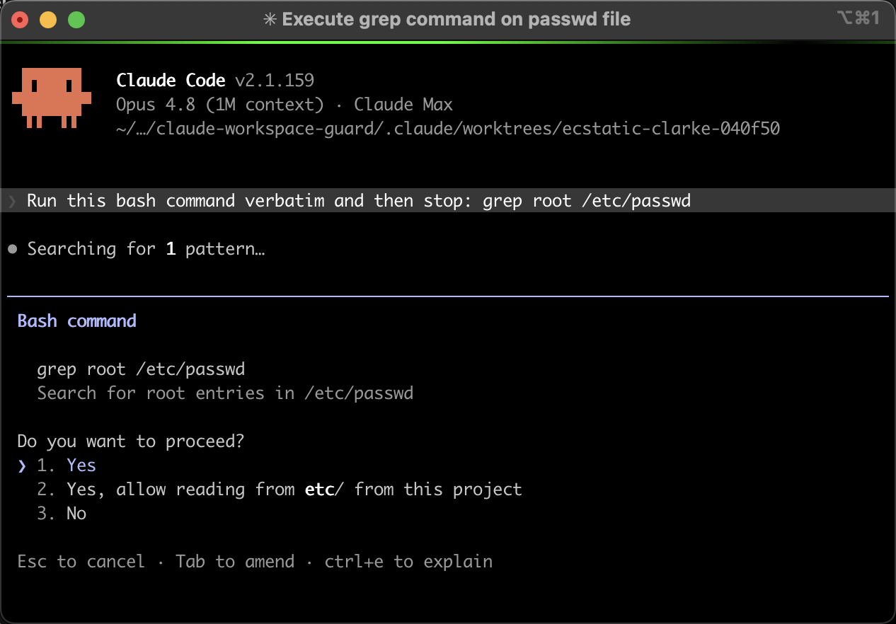

# workspace-guard

**Path-aware bash permissions for Claude Code.**

[](LICENSE) [](#install)

You ask Claude to "find that auth error." It runs `grep -r token /var/log`. Or
`cat ~/.aws/credentials` while "checking the environment." Or pipes a file from
outside your repo into `jq`. The default `Bash(grep:*)` permission rules can't
tell these apart from the dozens of in-repo greps Claude runs every session —
they either trust every invocation or prompt on every one.

workspace-guard is a `PreToolUse` hook for `Bash` that parses the command, finds
its file arguments, and asks for confirmation only when a path resolves outside
your project root (`$CLAUDE_PROJECT_DIR`). In-repo reads and pure pipelines run
silently.



## What it does

The hook produces one of three outcomes:

- **allow** — the command runs without a prompt.
- **ask** — Claude Code shows its standard permission prompt for the command
  (as above). You approve or reject.
- **defer** — the hook stays silent; your normal permission settings apply.

Guarded commands: `grep` (and `egrep`, `fgrep`), `rg`, `sed`, `awk` (and
`gawk`, `mawk`), `jq`, `cat`, `head`, `tail`. These are the file-reading
commands Claude reaches for most often; tools like `ls`, `find`, and `xargs`
aren't covered yet (see [`docs/STATUS.md`](docs/STATUS.md)).

| Command                              | Decision |
| ------------------------------------ | -------- |
| `grep foo ./src.txt`                 | allow    |
| `rg -g '*.py' foo ./src`             | allow    |
| `cat data.txt \| grep foo`           | allow    |
| `jq '.a/.b' data.json`               | allow    |
| `sed 's/a/b/g' notes.md`             | allow    |
| `cat data.txt > /dev/null`           | allow    |
| `cat <<<"/etc/foo"` (here-string)    | allow    |
| `grep secret /etc/passwd`            | **ask**  |
| `jq '.x' /etc/hosts`                 | **ask**  |
| `sed -f /tmp/evil.sed notes.md`      | **ask**  |
| `grep foo data.txt > /tmp/out.txt`   | **ask**  |
| `cat ../../etc/passwd`               | **ask**  |
| `cat ~/.aws/credentials`             | **ask**  |
| `cat $HOME/.ssh/id_rsa`              | **ask**  |
| `cd /etc && cat passwd`              | **ask**  |
| `ls /etc`                            | defer    |

Note the `jq` row: `.a/.b` is a jq program, not a filesystem path. The hook
knows the difference because it parses each command against a per-command spec
of which positions are programs, which are files, and which flags take values.
A naive string match would either miss real file arguments or false-positive on
program syntax.

## Install

```
/plugin marketplace add karlkfi/claude-workspace-guard
/plugin install workspace-guard@workspace-guard
```

- Requires `python3` on your PATH.
- Restart Claude Code so the hook is registered.

To verify, ask Claude to run `grep root /etc/passwd` — you should see a
permission prompt citing the outside-workspace path. Then ask it to `grep` a
file in your repo; it should run without prompting.

## How it works

1. **Tokenize** the command with Python's `shlex` (POSIX mode, punctuation
   grouping) so quotes are respected and shell operators (`|`, `&&`, `>`, `;`)
   become their own tokens.
2. **Split** into simple commands on those operators and pull redirect targets
   (`> file`) aside as files to check. The token after `<<` (heredoc
   delimiter) or `<<<` (here-string content) is skipped — it isn't a path.
3. **Classify** each token using a per-command spec table that knows which flags
   take values (`grep -e PAT`), which flag-values are themselves files
   (`grep -f`, `jq --slurpfile`), and how many leading positionals are the
   program/pattern to skip.
4. **Track** cwd shifts across the chain. A `cd`/`pushd` in an earlier group
   re-roots relative file paths in later guarded groups (so
   `cd /etc && cat passwd` flags `passwd` as `/etc/passwd`). When the new cwd
   can't be resolved at hook time — bare `cd`, `cd -`, `cd $HOME`, `popd` —
   later relative paths short-circuit to `ask`.
5. **Resolve** every file argument against `$CLAUDE_PROJECT_DIR` with
   `realpath`, collapsing `../` and following symlinks. Anything that resolves
   outside the root yields `ask`; otherwise `allow`. Tokens that bash would
   expand at runtime — leading `~` or any `$` — short-circuit to `ask`, since
   `realpath` would otherwise lexically place them inside `cwd`. Well-known
   device paths (`/dev/null`, `/dev/stdin`, `/dev/stdout`, `/dev/stderr`,
   `/dev/zero`, `/dev/tty`, `/dev/random`, `/dev/urandom`, `/dev/fd/N`) are
   allowlisted and skip the workspace check.

## Configuration

The set of guarded commands lives in the `SPEC` and `ALIASES` tables at the top
of `scripts/bash-workspace-guard.py`. Add a row to guard another command. To
switch from prompting to hard-blocking, change `"ask"` to `"deny"` in the
script's final output.

## Limitations

- Tokens that bash would expand at runtime — leading `~` or any unquoted `$`
  (variables and command substitutions) — are treated as outside-workspace.
  This is the secure-by-default choice: a literal filename containing `$`
  will get an `ask` prompt rather than slip through.
- `realpath` only follows symlinks for files that already exist; nonexistent
  paths are normalized lexically (fine for read-style commands).
- Redirect targets (`> file`) are always resolved against the original cwd,
  not any `cd`-shifted cwd. A relative redirect after a `cd /etc` would still
  be checked against the original workspace cwd. Absolute redirect targets
  still get caught.
- In non-interactive / headless runs there is no one to answer an `ask` prompt,
  so it effectively blocks.

## Design

For the rationale behind the approach (why a hook, why `ask`, why a static
spec table, what alternatives were rejected), see [`docs/design.md`](docs/design.md).
Out-of-scope security observations from audits live in
[`docs/security-notes.md`](docs/security-notes.md).

## Contributing

Bugs, ideas, and questions go in
[GitHub Issues](https://github.com/karlkfi/claude-workspace-guard/issues).
For the development backlog and how to add new guarded commands, see
[`docs/STATUS.md`](docs/STATUS.md).

## License

MIT — see [LICENSE](LICENSE).
