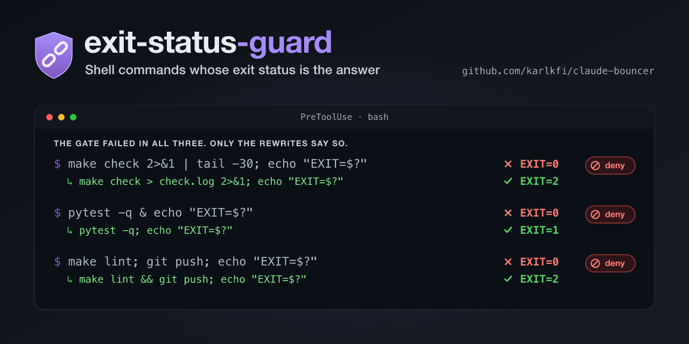

# exit-status-guard

**Guard rails for Claude Code shell commands whose exit status is the answer.**

[](https://github.com/karlkfi/claude-exit-status-guard/releases) [](https://github.com/karlkfi/claude-bouncer/actions/workflows/tests.yml) [](LICENSE) [](#install)



> The gate failed. The agent reported green. Both were telling the truth.

```
make check 2>&1 | tail -30; echo "EXIT=$?"
```

That prints `EXIT=0` for a failing gate. A pipeline reports its **last stage's**
status, so what you read is `tail`'s. Recovering the gate's own status from
the pipeline is not portable — `PIPESTATUS` is a bash feature, and under a
shell without it the usual rescue expands to empty and reads as success too.

Nothing here is a lie. The command ran, the exit status was read, the number was
reported accurately. The evidence was just incapable of showing failure. That is
the whole class: not a wrong answer, but a check that could only ever come back
green.

exit-status-guard is a `PreToolUse` hook on `Bash` that catches those shapes
before the command runs, and tells **the model** why — so the fix lands in the
rewrite rather than in a permission prompt you have to answer.

## Contents

- [What it does](#what-it-does)
- [What it does not deny](#what-it-does-not-deny)
- [Install](#install)
- [Upgrade](#upgrade)
- [Soundness: deny, never ask](#soundness-deny-never-ask)
- [The override escape hatch](#the-override-escape-hatch)
- [Configuration](#configuration)
- [Friction report](#friction-report)
- [Limitations](#limitations)
- [Companion plugins](#companion-plugins)
- [Design](#design)
- [Privacy](#privacy)
- [Contributing](#contributing)
- [License](#license)

## What it does

Three ways a status disappears, all of which turn a failure into a false green.

### 1. Piped into a filter

```bash
make check 2>&1 | tail -30      # denied — you get tail's status
go test ./... | grep FAIL       # denied
(cd sub && cargo test) | head   # denied — the subshell's status is cargo's
```

The fix is to redirect, then reconcile status against output separately:

```bash
make check > <scratchpad>/check.log 2>&1; echo "EXIT=$?"; grep -E 'FAILED|Error' <scratchpad>/check.log
```

`<scratchpad>` is the per-session scratchpad directory Claude Code creates under
`/tmp/claude-<uid>/`. The deny message resolves it to a literal path, so the
rewrite is copy-pasteable and the redirect cannot fail before the gate runs — a
build-output directory like `tmp/` is commonly gitignored, and so absent from a
fresh checkout. Where there is no scratchpad to name, the suggestion carries its
own `mkdir -p tmp &&` instead.

`set -o pipefail` earlier in the same command suppresses this, and so does
reading `$pipestatus` (lowercase, 1-indexed), which is zsh's spelling. Reading
`$PIPESTATUS` (uppercase) is denied on its own, gate or no gate — the array is
a bash feature, so under a shell without it the read expands to empty and every
test against it reads as success.

### 2. Backgrounded behind something that cannot carry failure

```bash
# with run_in_background: true
make check > <scratchpad>/c.log 2>&1; echo "EXIT=$?"    # denied
```

A `;`-list yields its **last** statement's status. The log says `EXIT=1` and
Claude Code's task notification says `completed (exit code 0)`, because the chain
ended with an `echo`. Capture the status and re-raise it:

```bash
make check > <scratchpad>/c.log 2>&1; rc=$?; echo "EXIT=$rc"; exit $rc
```

A literal `exit 0` at the end is treated as a deliberate discard, and is the way
out when a background call's status genuinely does not matter. The same command
in the **foreground** is fine and is not denied: there the trailing echo prints
the real status where it can be read.

### 3. Sequenced before a state change with `;`

```bash
make check; git push            # denied — the push runs either way
npm test; npm publish           # denied
git add .; git commit -m wip    # denied — a failed add commits nothing new
```

Here the status is read correctly and then ignored. `&&` is the fix, and is
never denied.

`&&` is not the fix when the second command has to run whatever the first did.
A mutation control mutates a file, runs a gate whose failure *is* the
assertion, and restores; `&&` skips the restore on the expected failure and
leaves the tree mutated. Capture the status and check it after the restore:

```bash
make check > <scratchpad>/c.log 2>&1; rc=$?; git checkout -- f; [ "$rc" -ne 0 ] || exit 1
```

The deny names both forms, `&&` first, because most sequencing denials do want
it. A restore that is itself a registry mutator — `git reset --hard`, `kubectl
delete` — is passed over rather than denied, so the suggestion above runs as
written. The restore has to be in `restores`, the status has to be captured
before it, and the capture has to be read after it; drop any one and the deny
comes back. A publish is never a restore, so
`make check > c.log 2>&1; rc=$?; git push; [ "$rc" -ne 0 ] || exit 1` still
denies — capturing a status does not make a push conditional on it.

## What it does not deny

The registry is deliberately not "every command". A guard that denies every
pipeline gets overridden reflexively and then means nothing.

```bash
git log --oneline | head -5             # informational, not a gate
cat tmp/check.log | tail -30
make help | grep check                  # exempt
make --version | head -1                # a capability probe
shellcheck --version | grep 0.11        # probes are structural, not per-tool
git show origin/main:CLAUDE.md | grep -n "make check"
git commit -m "fix: make check | tail was reporting EXIT=0"
git stash list | head                   # a read verb, so this is a read
git tag --sort=-v:refname | head -5     # a listing flag, so this is a read
make check; git tag -l                  # a read, so there is nothing to gate
make check; kubectl rollout status web
```

The last two matter most. Gate patterns are matched against the **head of a
shell segment** — its command word and arguments, after leading `VAR=val`
assignments and `bash`/`sudo`/`time`-style wrappers are peeled — never against
the raw command string. A pattern matched against the raw string also fires on
every `git show`, `grep`, and commit message that merely *names* the command. A
heredoc body is data, so a piped gate quoted in one is text; no rule handles that
case, the parser does.

The last four are the read forms of subcommands that also write. `git tag -a`
publishes and `git tag -l` lists; `kubectl rollout restart` rolls and `kubectl
rollout status` waits. Neither classifier can tell them apart from the
subcommand alone, so the split is made two ways, both of which hold for gates
added later:

- **A read verb in the subcommand path** — `list`, `ls`, `show`, `view`,
  `history` — reports state and changes none, so it is neither a gate nor a
  publish. Recognized structurally, so `git stash list`, `git worktree list`,
  and `kubectl rollout history` need no rows of their own. `status` is
  deliberately not one of them: `kubectl rollout status` waits for a condition
  and reports it as an exit code, so it stays a **gate** — a pipe still swallows
  the answer it waited for.
- **Where no verb splits them, the write forms are what gets registered.**
  `git tag --sort` lists and `git tag -a` publishes, and git grows listing flags
  every release while tag-creation flags stay put. So `gates` and `mutators`
  name the creating and deleting forms, and everything else is a read by
  default — enumerating the listing flags is the side that goes stale
  ([#19](https://github.com/karlkfi/claude-pipe-guard/issues/19)).

Capability probes (`--version`, `--help`, `-V`, `-h`) are recognized
structurally for every gate rather than by per-tool exemptions — a per-tool
pattern fixes the tool it was reported against and leaves the whole class. `-v`
is deliberately **not** a probe flag: it means `--version` to `make` but verbose
to `go test`, and exempting it would exempt `go test -v ./... | tail`, which is
the bug this guard exists to catch.

## Install

Install on any Claude Code surface that runs plugin `PreToolUse` hooks — the
CLI, the IDE extensions, or **Claude Code for Claude Desktop**. Both methods add
the same marketplace and plugin.

**Claude Code (CLI or IDE extension)** — run the slash commands:

```
/plugin marketplace add karlkfi/claude-bouncer
/plugin install exit-status-guard@claude-bouncer
```

**Claude Code for Claude Desktop** — use the **Customize** tab:

1. Open the **Customize** tab and go to its plugins / marketplaces section.
2. Add `karlkfi/claude-exit-status-guard` as a marketplace (the repo at
   `https://github.com/karlkfi/claude-bouncer.git`).
3. Find **exit-status-guard** in that marketplace, install it, and make sure it's
   enabled.

**Plan to update by hand.** This is a third-party git marketplace, so an install
pins its version until you act, and `autoUpdate: true` does not currently change
that. [Upgrade](#upgrade) has the commands that work, and the measurement behind
that claim.

After installing with either method:

- Requires Python 3 on your PATH, and no pip packages — the guard is stdlib
  only. The hook is launched through `scripts/run-python-hook.cmd`, which
  resolves an interpreter by trying `py -3`, `python`, then `python3` (on
  Windows) or `python3`, then `python` (elsewhere), so a working Python under
  any of those names is enough. If none of them runs, the guard reports the
  problem on stderr rather than failing silently.
- Restart Claude Code so the hook is registered.
- **Won't fire where plugin `PreToolUse` hooks don't run.** Claude Cowork and
  Claude Desktop's *native* assistant don't run them yet, so the guard never
  fires in those
  ([anthropics/claude-code#45514](https://github.com/anthropics/claude-code/issues/45514)).

To verify, ask Claude to run `make check | tail -5` — the call should be denied
with a reason naming the filter. Then ask it to run
`make check > <scratchpad>/c.log 2>&1; echo "EXIT=$?"` in the foreground; that
is the documented correct form and should run without comment.

## Upgrade

### 2.0.0 renamed the plugin: uninstall the old one

`pipe-guard` became `exit-status-guard` in 2.0.0. `pipe` named one of the three
always-on checks, and a gate backgrounded behind an `echo` or sequenced with `;`
is an exit-status loss with no pipe in it.

Claude Code keys an install on the plugin and marketplace names — the 1.x record
is `pipe-guard@pipe-guard`, cached under
`~/.claude/plugins/cache/pipe-guard/pipe-guard/1.0.1` — so the new name does not
replace the old one. Both the plugin and the marketplace it came from changed
name, so remove both and add them fresh.

**Claude Code (CLI or IDE extension)** — run the slash commands:

```
/plugin uninstall pipe-guard@pipe-guard
/plugin marketplace remove pipe-guard
/plugin marketplace add karlkfi/claude-bouncer
/plugin install exit-status-guard@claude-bouncer
```

**Claude Code for Claude Desktop / headless** — the same four, as CLI commands:

```bash
claude plugin uninstall pipe-guard@pipe-guard
claude plugin marketplace remove pipe-guard
claude plugin marketplace add karlkfi/claude-bouncer
claude plugin install exit-status-guard@claude-bouncer
```

Then restart Claude Code, since the hook is registered at startup. Nothing breaks
if you install the new one before removing the old: two `PreToolUse` hooks run,
either can deny, and `PIPE_GUARD_OVERRIDE=` satisfies both.

**Your configuration carries over, and you do not have to touch it.** The 1.x
names all still work:

| 1.x | 2.0.0 | Status |
|---|---|---|
| `PIPE_GUARD_OVERRIDE=` | `EXIT_STATUS_GUARD_OVERRIDE=` | Both work. The old one is undocumented and not going away. |
| `.claude/pipe-guard.json` | `.claude/exit-status-guard.json` | Both read. The new name wins outright when both exist — they are never merged. |
| `PIPE_GUARD_REGISTRY` | `EXIT_STATUS_GUARD_REGISTRY` | Both read, new name first. |

Renaming your own files is optional. The one thing worth knowing: with both
project registries present the 1.x one is ignored, not combined, so delete it
once you have moved its patterns.

The [friction report](#friction-report) reads both labels too, so history from
before the rename still shows up.

### Every release

exit-status-guard installs from a GitHub marketplace, which Claude Code tracks
at the repository's default branch (`main`). Claude Code auto-updates
**official Anthropic marketplaces only**, so an install pins its version until
you update it yourself. Concretely: a registry fix that stops a rule denying
your ordinary work is invisible to anyone still pinned to the version they
first installed.

### Update manually

This is the path that works today. Refresh the marketplace, then update the
plugin.

**Claude Code (CLI or IDE extension)** — run the slash commands:

```
/plugin marketplace update claude-bouncer
/plugin uninstall exit-status-guard@claude-bouncer
/plugin install exit-status-guard@claude-bouncer
```

The first command re-fetches the marketplace manifest from the repo; the
reinstall picks up the new version. Refreshing the catalog alone does **not**
upgrade an already-installed plugin — hence the explicit reinstall.

**Claude Code for Claude Desktop / headless** — Claude Desktop doesn't expose the
`/plugin` slash commands, but the `claude` CLI does the same thing and shares
Desktop's plugin state, so it works there and in any headless run:

```
claude plugin marketplace update claude-bouncer
claude plugin update exit-status-guard@claude-bouncer
```

`claude plugin update` updates in place (no uninstall/reinstall needed); it
prints "restart required to apply".

After upgrading either way:

- Run `/reload-plugins` to activate the updated hook without restarting, or
  restart Claude Code.
- Confirm the new version is live: the `/plugin` menu lists the installed
  version — compare it against the
  [latest release](https://github.com/karlkfi/claude-exit-status-guard/releases).

### `autoUpdate` does not fire yet

Add the marketplace to `~/.claude/settings.json` with `autoUpdate: true` if you
like — it costs nothing and starts working whenever Claude Code begins honoring
it:

```json
"extraKnownMarketplaces": {
  "exit-status-guard": {
    "source": { "source": "git", "url": "https://github.com/karlkfi/claude-bouncer.git" },
    "autoUpdate": true
  }
}
```

As of Claude Code 2.1.220 the setting is persisted and nothing acts on it: the
marketplace clone is never fetched. Measured against this repo's own
marketplace — installed with `autoUpdate: true`, `main` advanced 28 minutes
later, and a day and a half on the clone still had no `.git/FETCH_HEAD`. Git
writes that file on every fetch, including one that finds nothing new, so its
absence means no fetch has ever run. Tracked upstream as
[anthropics/claude-code#73673](https://github.com/anthropics/claude-code/issues/73673).

Until that lands, treat the manual commands above as the only way a fix reaches
you.

## Soundness: deny, never ask

Every verdict is a `deny`. That is a design choice, not a severity call.

A PreToolUse hook can return `ask` or `deny`, and both block the call. They
differ only in audience:

- `ask` renders a permission prompt **to you**. The model sees an approval
  request, not a diagnosis. Approve it and the next command has the same bug.
- `deny` returns a reason **to the model**, which is the thing that will rewrite
  the command.

The entire value of this guard is the explanation, and the explanation is only
useful to whoever is holding the keyboard for the rewrite. So exit-status-guard
never asks, regardless of how minor the case looks.

That audience decides the shape of the reason too. Every one opens with
`exit-status-guard: `, because the string is the whole of what the model
receives — an `ask` renders a prompt naming the hook, a deny does not — and a
session with several guards installed otherwise has to infer which one spoke
from the advice it gave. The sibling guards use the same `<name>-guard: ` form.

The corollary is that it also never `allow`s. A command it has no objection to
gets **silence**, which defers to your normal permission settings — the guard
speaks only about the status question and never approves anything on any other
axis.

Every failure path is silent too: an unparseable command, a missing registry, a
pattern that doesn't compile, malformed JSON on stdin. A hook that runs on every
Bash call must never be the reason one fails.

## The override escape hatch

```bash
EXIT_STATUS_GUARD_OVERRIDE=<reason> <command>
```

An environment prefix, because that is the only form a PreToolUse hook can see:
it reads the command string, and the session cannot set a variable in the hook's
own environment. This mirrors `WORKSPACE_GUARD_OVERRIDE` and
`PROD_GUARD_OVERRIDE` in the sibling guards.

The reason is required — a bare `EXIT_STATUS_GUARD_OVERRIDE=` is the
switch-it-off form and is ignored. The name only counts in command position:
quoted in a commit message or echoed into a pipe it is an argument, and
disables nothing.

**A rule that needs an override routinely is a defect to fix in the registry,
not to override.** Please
[file it](https://github.com/karlkfi/claude-bouncer/issues) instead of
reaching for the prefix every time.

## Configuration

Shipped defaults live in [`exit-status-guard.json`](exit-status-guard.json),
covering make, npm/pnpm/yarn/bun, pytest/ruff/mypy, go, cargo, gradle/maven,
dotnet, swift, bazel, cmake/ninja, rake/rspec, shellcheck, terraform, docker,
kubectl, helm, `scripts/*.sh`-style repo scripts, and the `git`/`gh` verbs
whose status matters.

A project extends them with its own `.claude/exit-status-guard.json`:

```json
{
  "gates": ["^bazelisk(\\s|$)"],
  "exempt": ["^make\\s+print-config(\\s|$)"],
  "mutators": ["^\\./deploy\\.sh(\\s|$)"],
  "restores": ["^\\./teardown\\.sh(\\s|$)"]
}
```

| Key | What it does |
|---|---|
| `gates` | Commands whose exit status **is** the answer. Drives all three rules. |
| `exempt` | Wins over **both** `gates` and `mutators`. For informational targets whose output, not status, is the point (`make print-config`). Read forms need no row when a read verb names them. |
| `mutators` | State-changing commands. Drives rule 3 only — the `;`-before-a-state-change case. |
| `restores` | The subset of `mutators` that reverts local state rather than publishing. Lets the capture-and-restore rewrite through; read only after `mutators` has matched, so an entry naming anything else is dead. |
| `replace` | `true` takes full control instead of extending the defaults. |

Project entries are **added** to the defaults, so naming one extra gate does not
silently drop the rest.

Patterns are Python regular expressions, anchored with `^` (enforced by the test
suite) and matched against the segment head. POSIX bracket classes
(`[[:space:]]`) are translated, so a pattern copied from an ERE-based registry
works unchanged.

Point `EXIT_STATUS_GUARD_REGISTRY` at a file to override the shipped defaults
wholesale.

Do not add per-tool `--version`/`--help` exemptions, or per-tool rows for a
`list`/`show` read — both shapes are recognized structurally for every gate, so
a per-tool pattern fixes one tool and leaves the class.

## Friction report

To see which rule fires most, and on which commands, run the friction report:

```
/exit-status-guard:friction-report              # last 7 days
/exit-status-guard:friction-report --since 24h
/exit-status-guard:friction-report --json       # machine-readable
```

It is a **read-only** analyzer: it re-reads the decisions Claude Code already
recorded in your local session transcripts and adds no telemetry (see
[PRIVACY.md](PRIVACY.md)). The report ranks denials by rule (`piped`,
`pipestatus`, `background`, `sequenced`), by the gate whose status was being
lost, and by triggering command.

**Read the counts as false greens caught, not as a friction rate.** Unlike the
sibling guards, exit-status-guard emits nothing when it has no objection, and a
hook run with no stdout leaves no transcript record — so there is no
denominator. A high
count is not by itself bad. What matters is the shape: the same command denied
over and over is either a habit worth fixing upstream or a defect in the
registry.

The report also warns when your installed exit-status-guard lags the version in the
local marketplace clone. The comparison is local-only, so no warning means "no
lag against the clone you have", not "up to date" — refresh with
`claude plugin marketplace update claude-bouncer` first if it has been a while.

You can also run the script directly:

```
python3 scripts/friction-report.py --since 30d --repo gateway --top 20
```

## Limitations

- **The registry is the detector.** Nothing is denied on shape alone, so an
  unregistered command piped into `tail` is invisible to this guard. Treat it as
  a net, not a wall — and extend `gates` for the tools your repo actually
  depends on.
- **A `bash -c '…'` body is not analyzed.** The quoted string is one word to the
  tokenizer, so a gate inside it is invisible. Backtick and `$(…)` bodies *are*
  analyzed.
- **Gate-then-gate with `;` is not denied.** `make lint; make test` really does
  lose `make lint`'s status, but rule 3 is scoped to state-changing commands,
  where the consequence is a publish rather than a misreported check. Widening it
  would deny a very common and mostly harmless shape, which trains the override
  reflex.
- **A command the tokenizer cannot parse gets silence, not a guess.** Unbalanced
  quotes, `| |`, and similar defer to normal permissions.
- **The PR check's line numbers are approximate.** A pull request's diff is
  numbered from its own merge base rather than this branch's, so a long-lived
  PR's ranges drift. Close enough to tell an edit in the same function from one
  at the other end of the file, which is the question being asked.
- **It cannot see what a gate does internally.** A `Makefile` target or shell
  script that swallows its own failure reports success to the shell, and the
  guard has no view into that.

## Companion plugins

exit-status-guard watches the **evidence** boundary — whether a command's
result can still be read after the shell is done with it. Its siblings guard other axes
with the same secure-by-default design:

- [**workspace-guard**](https://github.com/karlkfi/claude-bouncer) — the
  **filesystem** boundary: prompts before guarded file commands
  (`grep`/`sed`/`cat`/`cp`/`rm`/…) read or write paths outside the project root.
- [**branch-guard**](https://github.com/karlkfi/claude-bouncer) — the **git
  history** boundary: auto-approves safe git on feature branches, pauses commits
  and pushes to `main` and destructive git.
- [**prod-guard**](https://github.com/karlkfi/claude-bouncer) — the
  **infrastructure blast-radius** boundary: denies mutations aimed at production
  contexts.
- [**foreground-guard**](https://github.com/karlkfi/claude-bouncer) — the
  **liveness** boundary: keeps polling, watching, and blocking commands from
  stalling the session's main thread.
- [**pr-sentinel**](https://github.com/karlkfi/claude-pr-sentinel) — the
  **review** boundary: watches a PR to green without merging it, and denies a
  `gh pr create` whose branch edits lines an open PR already changes.

They run side by side; each defers to normal permissions outside its own axis.
The guards share one marketplace —
[`karlkfi/claude-bouncer`](https://github.com/karlkfi/claude-bouncer#install)
lists the install line for each — and pr-sentinel ships from its own.

branch-guard also owns the check for a `git push` onto a base that has moved
into this branch's own lines, which exit-status-guard carried briefly and never
released.

## Design

For the rationale behind the approach — why deny rather than ask, why patterns
match the segment head instead of the command string, why probes are structural,
and why stdlib Python was the right call when the prior art needed a real shell
parser — see [`docs/design.md`](docs/design.md).

## Privacy

The hook runs entirely on your machine and has no network access, telemetry, or
analytics. It reads the pending Bash command and the registry files, decides in
memory, and writes nothing to disk. The friction report is a read-only analyzer
over transcripts Claude Code has already written. See [`PRIVACY.md`](PRIVACY.md)
for the full policy.

## Contributing

Bugs, ideas, and questions go in
[GitHub Issues](https://github.com/karlkfi/claude-bouncer/issues).

A rule that denies ordinary work is a bug worth reporting — include the exact
command and the deny text. For development conventions (stdlib only, never
`ask`, don't hand-roll shell parsing, assert both directions), see
[`CLAUDE.md`](CLAUDE.md).

## License

MIT — see [LICENSE](LICENSE).
