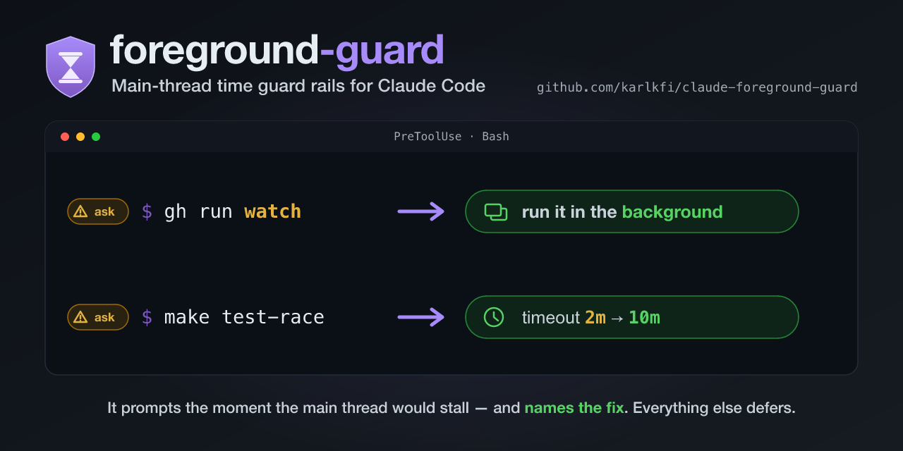

# foreground-guard

**Main-thread time guard rails for Claude Code Bash commands.**

[](https://github.com/karlkfi/claude-bouncer/actions/workflows/tests.yml) [](LICENSE) [](#install)



> The main thread is the one you're talking to. Don't let it sit and watch
> paint dry — and don't let a 10-minute test run get killed at minute 2.

Agents foreground-poll instead of backgrounding. In one repo's two-week
transcript sample, **~130 Bash calls were blocking polls** — `gh pr checks
--watch`, `gh run watch`, `tail -f`, `sleep`-loops — each one parking the
session's main thread until something killed it. In the same sample, **36
slow runs** (envtest suites, e2e runs, `-race` builds) were killed by the
Bash tool's **default 2-minute timeout**, wasting the entire run each time.
Repos carry prose rules in CLAUDE.md to prevent this ("never watch in the
foreground", "always set timeout on make test-race") — and agents still do
it. A hook enforces the rule mechanically and teaches the fix in the denial
message at the exact moment of violation.

foreground-guard is a `PreToolUse` hook for `Bash` that catches two classes
of main-thread time-wasters:

- **Class A — foreground poll/watch**: watch/follow modes (`gh run watch`,
  `kubectl logs -f`, `tail -f`, `watch ...`), shell loops that poll with
  `sleep`, chained repeat-with-sleep sequences, and bare `sleep N` waits at
  or above a configurable floor.
- **Class B — slow command with an inadequate timeout**: a command the repo
  has registered as needing more than the Bash call's timeout — about to be
  killed mid-run. The registry ships **empty**; slow-command knowledge is
  per-repo config.

Both classes **deny**, and the reason carries the rewrite. That is a routing
decision, not a severity one: what is at stake is the session's own main
thread, so a human at the prompt holds no fact the agent lacks, and every
finding has a fix the agent can apply on its own. Set `"action": "ask"` to
watch the guard work instead (see [Configuration](#configuration)).

Everything else passes through silently, so your normal permissions apply.

## Contents

- [What it does](#what-it-does)
- [Install](#install)
- [Keeping it updated](#keeping-it-updated)
- [Covered forms](#covered-forms)
- [Exemptions](#exemptions)
- [Configuration](#configuration)
- [Friction report](#friction-report)
- [Unattended permission modes](#unattended-permission-modes)
- [The override escape hatch](#the-override-escape-hatch)
- [Soundness: never `allow`](#soundness-never-allow)
- [Limitations](#limitations)
- [Companion plugins](#companion-plugins)
- [Privacy](#privacy)
- [License](#license)

## What it does

The hook produces one of three outcomes per Bash call:

- **deny** — the default for both classes. The reason is fed back to the
  agent as the blocked call's error, and it carries the fix: take ONE
  non-blocking snapshot (`gh pr checks <n>` without `--watch`, `tail -n 100`
  instead of `tail -f`), arm a Monitor whose script exits when the condition
  flips, or bound the wait explicitly with `timeout N ...`. Backgrounding is
  not among them — a detached poll blocks too, so a Class A reason that
  offered it would be routing the agent into a second block. Class B names
  the exact minimum: "set `timeout: 600000` on this Bash call, or run it in
  the background." Cleared for one call with a
  `FOREGROUND_GUARD_OVERRIDE=<reason>` prefix.
- **ask** — Claude Code's standard permission prompt, carrying the same
  reason. Only reached by setting `"action": "ask"` on a class: the
  supervised posture, for someone building trust in the guard. In an
  [unattended permission mode](#unattended-permission-modes) it reverts to a
  deny, because no one is there to answer it.
- **defer** — the hook stays silent; your normal permission settings apply.
  foreground-guard never emits `allow` (see
  [Soundness](#soundness-never-allow)).

Why deny rather than ask: the fix is always something the agent can do and
never something the human at the prompt can. Approving a Class B prompt runs
the command unchanged and it is still killed at the timeout — the two fixes
are parameters of the Bash call, which only the agent can re-issue. A deny's
false positive costs the agent one retry; an ask's costs a person a context
switch on every matching call, forever.

The table below shows the decision with default config.

| Command | Decision |
| --- | --- |
| `gh pr checks 123` | defer |
| `gh pr checks 123 --watch` | **deny** |
| `gh run watch 456` | **deny** |
| `gh run watch 456` with `run_in_background: true` | **deny** (still a poll — see [Exemptions](#exemptions)) |
| `gh run watch 456 &` | defer (detached) |
| `timeout 30 gh run watch 456` | defer (explicitly bounded) |
| `FOREGROUND_GUARD_OVERRIDE=demo gh run watch 456` | defer (see [the override](#the-override-escape-hatch)) |
| `kubectl logs -f pod/api` | **deny** |
| `kubectl get pods -w` | **deny** |
| `kubectl get pods -o wide` | defer |
| `tail -f app.log` | **deny** |
| `tail -n 50 app.log` | defer |
| `grep -f patterns.txt src/` | defer |
| `git log --follow -- README.md` | defer |
| `journalctl -f`, `docker logs -f c1`, `watch kubectl get pods` | **deny** |
| `while true; do gh pr checks 1; sleep 5; done` | **deny** (poll loop) |
| `gh pr checks 1; sleep 5; gh pr checks 1` | **deny** (repeat-with-sleep) |
| `sleep 300` | **deny** (≥ floor, default 10 s) |
| `sleep 2 && curl localhost:8080/health` | defer (below floor) |
| `./server > log 2>&1 & sleep 2; curl localhost` | defer (server detached, grace sleep short) |
| `sleep 30 & make build` | defer (sleep backgrounded) |
| `bash -c 'while true; do sleep 5; done'` | **deny** (recursed) |
| `bash poll-forever.sh` | defer (script files stay opaque) |
| `cat <<EOF` … `tail -f x` … `EOF` | defer (heredoc body is data) |
| `make test-race` (configured min 600000 ms, default timeout) | **deny** (names the minimum) |
| `make test-race` with `timeout: 600000` | defer |
| `make test-race` with `run_in_background: true` | defer |

## Install

Install on any Claude Code surface that runs plugin `PreToolUse` hooks — the
CLI, the IDE extensions, or **Claude Code for Claude Desktop**.

**Claude Code (CLI or IDE extension)** — run the slash commands:

```
/plugin marketplace add karlkfi/claude-bouncer
/plugin install foreground-guard@claude-bouncer
```

**Claude Code for Claude Desktop** — use the **Customize** tab:

1. Open the **Customize** tab and go to its plugins / marketplaces section.
2. Add `karlkfi/claude-foreground-guard` as a marketplace.
3. Find **foreground-guard** in that marketplace, install it, and enable it.

After installing with either method:

- Requires `python3` on your PATH.
- Restart Claude Code (or `/reload-plugins`) so the hook is registered.
- **Turn on auto-update now.** A GitHub marketplace pins the version you
  installed and never refreshes on its own (see
  [Keeping it updated](#keeping-it-updated)). Add this to
  `~/.claude/settings.json` at install time, while you're thinking about it:
  ```json
  {
    "extraKnownMarketplaces": {
      "foreground-guard": {
        "source": { "source": "git", "url": "https://github.com/karlkfi/claude-bouncer.git" },
        "autoUpdate": true
      }
    }
  }
  ```
- **Register your repo's slow commands** — the Class B registry ships empty;
  it only helps once your repo's `.claude/foreground-guard.json` names the
  commands that outlive the default timeout. See
  [Configuration](#configuration).

To verify, ask Claude to run `gh run watch 123` — it should be blocked with
a foreground-guard reason naming the snapshot to take instead.
`tail -n 50 some.log` should run without any foreground-guard output.

## Keeping it updated

Claude Code auto-updates **official Anthropic marketplaces only**.
foreground-guard installs from a third-party GitHub marketplace, and those
**never refresh on their own** — the version you installed stays pinned
until you either enable auto-update or update it by hand.

**Recommended — set and forget.** Add `autoUpdate` for the marketplace in
`~/.claude/settings.json` and Claude Code refreshes it like an official one:

```json
{
  "extraKnownMarketplaces": {
    "foreground-guard": {
      "source": { "source": "git", "url": "https://github.com/karlkfi/claude-bouncer.git" },
      "autoUpdate": true
    }
  }
}
```

**Manual.** Update the marketplace clone, then the installed plugin, then
restart to apply:

```
claude plugin marketplace update claude-bouncer
claude plugin update foreground-guard@claude-bouncer
```

## Covered forms

**Class A — watch/follow registry** (built-in; extensible via config):

| Form | Snapshot alternative taught |
| --- | --- |
| `gh pr checks ... --watch` | `gh pr checks <pr>` once, without `--watch` |
| `gh run watch <id>` | `gh run view <run-id>` once |
| `kubectl`/`oc` `logs -f` / `--follow` | `kubectl logs --tail=100` |
| `kubectl`/`oc` `get -w` / `--watch` / `--watch-only` | `kubectl get` once |
| `tail -f` / `-F` / `--follow` (incl. combined `-fn50`) | `tail -n 100` |
| `journalctl -f` / `--follow` | `journalctl -n 100` |
| `docker`/`podman`/`nerdctl` `logs -f` / `--follow` | `--tail 100` |
| `watch <cmd>` | run the wrapped command once |

**Class A — loop and sleep forms:**

- `while`/`until`/`for` loops whose body runs `sleep` (any duration — the
  loop multiplies it).
- Chained repeat-with-sleep: `cmd; sleep N; cmd; ...` — a sleep sandwiched
  between commands is a poll regardless of `N`.
- Bare `sleep N` as a foreground segment with `N ≥` the floor (default
  10 s). `sleep $VAR` counts as long (unknown durations lean toward
  blocking, and the reason asks for the literal). Below-floor sleeps —
  startup grace like `sleep 2 && curl ...` — pass.

Matching is anchored to the tool name, so `grep -f patterns.txt`,
`git log --follow`, and `-f` flags on unrelated tools never match. The hook
recurses into quoted `bash -c '...'` and `eval ...` bodies (bounded), but
`bash some-script.sh` stays opaque — no script-file inspection. A repo that
hits a false-positive on a specific built-in watch form can quiet just that
one with a `poll.exempt_watch_patterns` allowlist entry (exemptions win over
matches) instead of turning off all of Class A — see
[Configuration](#configuration).

**Class B — slow-command registry** (config-only, ships empty): entries
mapped to a minimum timeout in ms. When a matched command would run in the
foreground with the Bash call's `timeout` below the minimum (or unset — the
2-minute default), the guard denies and names the exact fix. Two registration
forms:

**Target form** — `"<command>": {"<target glob>": ms}` — for the common
"this command with this argument" case (`make e2e`, `go test -race`), where
the hook does the anchoring itself: the command word must equal `<command>`
(compared by basename, so `/usr/bin/make` counts), and the glob must match a
**whole argument word**. `{"make": {"e2e*": 1800000}}` fires on `make e2e`,
`make -C sub e2e-test`, and `git pull && make e2e`, but never on
`make -n help NOTE="a note mentioning e2e"` — a quoted argument is one word,
and `e2e*` doesn't match it from the start. This is the recommended shape:
no regex to get wrong.

**Regex form** — `"<regex>": ms` — matches at a **command position**: the
command is split into simple commands the same way Class A splits it
(heredoc bodies stripped, env prefixes and `nohup`/`time`/`timeout` wrappers
peeled, `bash -c '...'` and `eval` bodies recursed into, `bash gate.sh`
reduced to the script), and the pattern has to match starting inside a
segment's command word. So registering a bare path —
`"scripts/gate\\.sh": 3600000` — fires on `scripts/gate.sh`,
`./scripts/gate.sh --all`, `CI=1 nohup scripts/gate.sh`, and
`git fetch && bash scripts/gate.sh`, but not on `grep -n foo scripts/gate.sh`,
`wc -l scripts/gate.sh`, or a `git commit -m` whose message quotes the path.
To register an **argument** instead of a command, prefix the pattern with
`.*` (`".*-race\\b"`) — that opts back into matching anywhere in a segment,
still not across the whole command line. **A `.*` in a regex reaches into
quoted arguments**: `"make .*\\be2e"` fires on any `make` invocation whose
arguments mention e2e anywhere, including inside a quoted string. When the
thing being registered is a command plus an argument word, use the target
form instead.

## Exemptions

These pass untouched, by design:

- **`run_in_background: true`** on the Bash call — **Class B only.**
  Backgrounding is the fix Class B teaches, so a registered slow command
  passes. It does not fix a poll: a detached `gh run watch` or `sleep`-loop
  moves the wait off the main thread without removing it — it holds a task
  slot for the whole run and hands back output whose freshness the agent
  can't judge. Class A still blocks on a backgrounded call, with reasons
  worded for a detached wait; the fixes they teach are the same either way,
  and `run_in_background` is not one of them. A repo that wants a specific
  watch form quiet in every mode can list it in `poll.exempt_watch_patterns`.
- **A trailing `&`** that detaches the blocking command (including a
  backgrounded subshell or loop). A mid-command `& ` exempts just that
  segment: `sleep 30 & make build` passes.
- **A `timeout N ...` wrap** exempts the wrapped command from Class A —
  a silent defer, not a downgraded block. Rationale: an explicit bound is
  precisely the fix the guard teaches, and the Bash tool's own timeout still
  backstops it. `timeout 30 gh run watch 123` runs without friction.
- **A `FOREGROUND_GUARD_OVERRIDE=<reason>` prefix** — the agent asserting
  the wait is intended. See [the override](#the-override-escape-hatch).
- **Heredoc bodies** are stripped before analysis — `tail -f` inside a
  document you're writing is data, not a command.

## Configuration

Per-repo file: `.claude/foreground-guard.json` (also read from
`~/.claude/foreground-guard.json` for user-level defaults, and from a file
named by `$FOREGROUND_GUARD_CONFIG`). Scalars are last-present-wins (project
overrides user); pattern lists and the slow-command registry merge
additively.

```json
{
  "poll": {
    "enabled": true,
    "action": "deny",
    "extra_watch_patterns": ["^mytool\\s+follow\\b"],
    "exempt_watch_patterns": ["^gh\\s+run\\s+watch\\b"],
    "sleep_floor_seconds": 10
  },
  "slow": {
    "enabled": true,
    "action": "deny",
    "commands": {
      "make": {"test-race": 600000, "e2e*": 1800000},
      "go test ./\\.\\.\\..*-race": 600000
    }
  },
  "hint": "pr-sentinel watches PRs in this repo — don't poll gh yourself"
}
```

| Key | Default | Meaning |
| --- | --- | --- |
| `poll.enabled` | `true` | Class A on/off (switch off as the harness subsumes it) |
| `poll.action` | `"deny"` | `"ask"` de-escalates Class A to a prompt — the supervised posture, and it costs you one prompt per finding |
| `poll.extra_watch_patterns` | `[]` | extra regexes matched against each wrapper-stripped command segment |
| `poll.exempt_watch_patterns` | `[]` | allowlist regexes over the same segment string; a match suppresses the watch/follow detection (exemptions win over matches) — quiet a false-positive built-in without disabling all of Class A |
| `poll.sleep_floor_seconds` | `10` | bare `sleep N` prompts at or above this |
| `slow.enabled` | `true` | Class B on/off |
| `slow.action` | `"deny"` | `"ask"` de-escalates Class B to a prompt — note that approving one runs the command unchanged, so it is still killed at the timeout |
| `slow.commands` | `{}` | target form: command name → `{argument glob: minimum timeout ms}` (whole-word glob per argument — recommended); regex form: regex matched at a command position (prefix `.*` to match an argument) → minimum timeout ms |
| `hint` | `""` | repo-specific line appended to Class A reasons, naming your own watcher machinery |

Environment variables: `FOREGROUND_GUARD_DISABLE=1` turns the hook off for a
session; `FOREGROUND_GUARD_CONFIG=<path>` adds a config file;
`FOREGROUND_GUARD_DEBUG=1` re-raises instead of failing open (development).

## Friction report

Run `/foreground-guard:friction-report` to see where the guard's prompts land.
It re-reads the decisions Claude Code already recorded in your local session
transcripts (no telemetry — see [PRIVACY.md](PRIVACY.md)) and ranks them, so you
can tell in one command whether the friction is mostly foreground watching,
`sleep`-polling, or slow commands hitting an inadequate timeout.

```
/foreground-guard:friction-report                      # last 7 days
/foreground-guard:friction-report --since 24h --repo gateway
/foreground-guard:friction-report --json               # machine-readable
```

The `foreground-guard:` prefix is worth keeping: the companion guards
([prod-guard](#companion-plugins), workspace-guard) each ship their own
`friction-report`, so the bare `/friction-report` is ambiguous when more than
one is installed.

Prompts are grouped into a stable category taxonomy, each mapping to one fix:

| Category | Class | Fix it teaches |
| --- | --- | --- |
| `watch` | A | one non-blocking snapshot instead of streaming |
| `loop-sleep` | A | one status check now; check again next turn |
| `sandwich` | A | one status check now; check again next turn |
| `bare-sleep` | A | skip the wait; do the follow-up check now |
| `slow-timeout` | B | set an adequate `timeout:` on the call, or background it |

The friction rate divides by Bash calls, not by the guard's own decisions. A
silent defer leaves no record at all — Claude Code writes one only for a hook
that produced output, and this guard prints nothing when it defers and never
prints `allow` — so a share of its decision records reads 100% however the config
is tuned. Bash calls are recorded whatever a hook decided, which also makes the
single-guard rate comparable with `--plugin all`. The line under it counts
sessions instead of calls: how often a session got interrupted at all. The
denominator is every Bash call in the window, so a guard installed part-way
through one reads low until the window catches up; the report says so.

Denies take a second route into the report, and since both classes deny by
default that route now carries nearly all of it. Claude Code records a hook's
stdout only for a call it goes on to run, so a `deny` leaves no decision record
at all — counting that stream alone would report zero friction for this guard.
The report recovers them from the error the blocked call handed back, whose text
is the reason the hook printed.

That recovery keys on the `foreground-guard: ` opener every reason here carries,
which makes it complete for this guard and partial across guards.
`python3 scripts/friction-report.py --plugin all` reports every sibling guard's
decisions found in the transcripts, and says so in a note: a guard wording its
reason differently still under-counts its denies, so a low deny count there is
not evidence that guard rarely blocks. The `FOREGROUND_GUARD_OVERRIDE prefixes`
count is this guard's alone, so `--plugin all` omits it (and its `overrides` JSON
key) rather than show one guard's statistic under an all-guards header.

That count comes from a third place again — the Bash commands themselves. An
overridden call makes the guard defer, so it leaves no decision to read, and the
prefix on the command is what the transcript keeps. Reading it there also catches
an override pasted onto calls the guard would never have blocked, which is the
over-use worth seeing.

The reader takes any `*-guard` name plus the siblings named outside that shape
(pr-sentinel), and stops there: an opener of `<any word>: ` would read `error:`
and `Traceback:` as denies too. What the siblings have to do for `--plugin all`
to be honest is written up in
[cross-guard-deny-convention.md](docs/development/cross-guard-deny-convention.md),
with the current cost: over 939 local transcripts, 243 denies were readable and
641 were not.

Some records are neither a decision nor a deny. Claude Code writes an attachment
for a hook that crashed or timed out as well as for one that spoke, and a crashed
hook's stdout is empty — indistinguishable from a silent defer unless you read
the record's `type`. The report reads it and counts those as `error`, because a
defer means the guard looked and let the call through while an error means it was
never consulted, so the call ran unguarded. They are listed above the prompt
rankings, naming the exit code and the first line of stderr: a guard that stopped
running matters more than any prompt count, and `--plugin all` is where you would
notice a sibling has.

For the "don't just show me the numbers, help me fix them" case, the
**`reduce-foreground-guard-prompts`** skill diagnoses the friction — grounding
itself in that same report — maps each category to its fix, and offers a
`CLAUDE.md` playbook. Ask Claude "why am I getting so many foreground-guard
prompts?" to trigger it.

## Unattended permission modes

With default config this section changes nothing: both classes already deny in
every mode. It matters once you have set `"action": "ask"` on a class, because
three modes cannot deliver the prompt you asked for — so a de-escalated `ask`
is emitted as a `deny` again there.

| Mode | What Claude Code does with a hook `ask` |
| --- | --- |
| `default`, `acceptEdits`, `plan` | prompts you — the supervised posture works as intended |
| `auto` | prompts you *anyway*, interrupting the run you chose not to babysit |
| `dontAsk` | converts it to its own generic deny, dropping the guard's reason |
| `bypassPermissions` | leaves the run stalled on a prompt no one can answer |

A `deny` blocks the same way but returns the reason to the agent, which reads
the fix and retries with one snapshot, a Monitor, or a `timeout` bound — no
human in the loop. Every deny names the fixes first, then the override escape
hatch, then the [friction report](#friction-report), so a wrong verdict gets
reported rather than worked around.

## The override escape hatch

When a foreground wait (or a short-timeout run) is genuinely intended, prefix
the command and the guard defers:

```
FOREGROUND_GUARD_OVERRIDE=demo-needs-live-tail tail -f app.log
```

Deferring is not allowing. The hook stops objecting and says nothing, so your
normal permission settings and the sibling guards still see the call — see
[Soundness](#soundness-never-allow).

The prefix is set by the agent, and that is the point: the agent holds the fact
the hook is missing, and a wrong assertion costs waiting and nothing else. There
is no blast radius here to justify spending a person's attention confirming it.
Two consequences worth knowing:

- **It works in every permission mode**, including `dontAsk` and
  `bypassPermissions`, where a downgrade-to-a-prompt would have bought a prompt
  no one could answer.
- **The reason is the audit record**, and it lives on the command string in the
  transcript rather than in anything the hook prints — which is why the
  [friction report](#friction-report) counts overrides from the commands. Make
  it say why the wait is required.

Guards protecting something outside the repo should not copy this. An override
the agent can set is a control against accidents, not against a bad context: the
same reasoning that produced the command produces the justification. It is the
right tier here because the worst case is a session that waits.

## Soundness: never `allow`

The hook only ever returns `ask`, `deny`, or nothing (defer). It **never**
emits `permissionDecision: "allow"` — an allow would bypass your permission
settings and override sibling guards evaluating the same command. This
invariant is asserted on every end-to-end call in the test suite. All
failure directions follow from the guard's job:

- **Infrastructure errors fail open** (bad JSON, unreadable config,
  unexpected exception → silent defer): a productivity guard must never
  break the session.
- **Unknown durations fail toward friction** (`sleep $N` blocks): a false
  positive costs the agent one retry; a false negative parks the main thread.
  The reason asks for the literal duration rather than routing the question at
  a human, who sees the same unexpanded `$N` and can resolve it no better.
- **Parsing uncertainty defers**: unlike a security guard, a missed poll
  costs waiting, not an outage — so unparseable commands pass rather than
  guess.

## Limitations

- `bash some-script.sh` is opaque: a poll loop inside a script file is not
  seen (same policy as the sibling guards — no file inspection).
- Watch modes reached through uncovered wrappers or aliases
  (`k logs -f ...`) need an `extra_watch_patterns` entry.
- Class B matches the command text as written; a slow command constructed at
  runtime (`make $TARGET`) won't match, and neither will one reached through
  a wrapper the segmenter doesn't peel.
- The guard cannot take the snapshot or arm the Monitor for you — it can only
  teach the fix and let the agent retry. Monitor is a Claude Code tool; on a
  surface that doesn't offer it the other two fixes still stand.

## Companion plugins

- [workspace-guard](https://github.com/karlkfi/claude-bouncer) —
  keep Bash file operations inside the workspace.
- [branch-guard](https://github.com/karlkfi/claude-bouncer) — keep
  commits off protected branches.
- [prod-guard](https://github.com/karlkfi/claude-bouncer) — block
  mutating infrastructure commands aimed at production.

All four compose: none of them ever emits `allow`, so each can only add
friction, never remove another's.

Writing a guard of your own? Open every `deny` reason with your plugin's name,
so the cross-guard `--plugin all` friction report can count your denies —
[cross-guard-deny-convention.md](docs/development/cross-guard-deny-convention.md)
says why that opener is the only trace a deny leaves.

## Privacy

Everything runs locally; the hook reads the command from stdin and local
config files, and writes a decision to stdout. No telemetry, no network.
See [PRIVACY.md](PRIVACY.md).

## License

[MIT](LICENSE)
